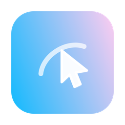

<p align="center">
  
</p>

# open-computer-use

[](https://github.com/opensymph/open-computer-use/releases)
[](./README.md)

一个本地 MCP 服务器，给 AI Agent 一双看得见桌面、摸得着应用的手。Agent 可以读取应用界面、点击、输入、滚动、拖拽——全部通过无障碍层完成，不抢占你真实的鼠标和键盘。完全本地运行，支持 macOS、Windows 和 Linux。

## 工具面

九个核心工具，三个平台完全一致：

| 工具 | 作用 |
| --- | --- |
| `list_apps` | 列出运行中和最近使用的应用。 |
| `get_app_state` | 读取应用的完整无障碍树和截图。 |
| `click` | 按 `element_index` 或截图坐标点击。 |
| `perform_secondary_action` | 调用元素自带的次要操作。 |
| `scroll` | 按页滚动元素，或按像素增量滚动窗口。 |
| `drag` | 在两个坐标之间拖拽。 |
| `type_text` | 输入文本，Unicode 安全，优先后台写入。 |
| `press_key` | 按键或组合键（`ctrl+s`、`return`、`page_up`…）。 |
| `set_value` | 直接设置可写控件的值。 |

另有五个窗口级工具——`list_windows`、`get_window`、`get_window_state`、`launch_app`、`activate_window`——遵循新的 window2 API，当前在 Windows 上可用（macOS / Linux 进行中）。

## 快速开始

```bash
npm i -g @opensymph/open-computer-use
ocu doctor        # 验证安装；macOS 会引导授权
ocu call list_apps
```

macOS 14+ 需要一次性授予 `Accessibility` 和 `Screen Recording`。Windows 和 Linux 在已登录桌面会话中开箱即用（Linux 桌面需要 AT-SPI2，GNOME 等主流桌面默认自带）。

## 接入 Agent

```bash
ocu install-codex-mcp      # Codex CLI 与 Codex App
ocu install-codex-plugin   # Codex App 插件形态
ocu install-claude-mcp     # Claude Code
ocu install-gemini-mcp     # Gemini CLI（--scope user 装到用户级）
ocu install-opencode-mcp   # opencode
```

其他任何 MCP 客户端——手动添加：

```json
{
  "mcpServers": {
    "open-computer-use": { "command": "open-computer-use", "args": ["mcp"] }
  }
}
```

### ZCode

本仓库自带 ZCode 插件形态——一次安装同时获得 skill 和自动连接的 MCP 服务器：

1. 先装一次 runtime（插件在本地没有构建产物时会回退到它）：

   ```bash
   npm i -g @opensymph/open-computer-use
   ```

2. 在 ZCode 里打开 **Settings → Plugin Management → Discover**，点 **+**。
3. 添加本仓库——GitHub 地址 `opensymph/open-computer-use`，或本地 checkout 目录。
4. 在列表里找到 **Open Computer Use**，点 **Get** 安装。
5. 新开一个会话。到 **Settings → MCP** 确认 `open-computer-use` 已连接，然后直接说：“列出我屏幕上的窗口”。

以后想移除：Installed 标签 → Open Computer Use → uninstall。

**Agent skill** —— 教会 Agent 正确使用这套工具的技能包：

```bash
npx skills add opensymph/open-computer-use -g -a claude-code --skill open-computer-use -y
```

## 为什么选它

- **设计上就非侵入。** 优先走无障碍 API 而非合成输入；除非你显式开启全局输入，真实的指针、焦点和前台应用都不会被碰。
- **三个平台，一套契约。** 每个操作系统上工具名、参数、返回结构完全一致——Agent 不需要按平台分支。
- **看得见的光标。** macOS 上动作会驱动一个可见的软件光标，你能实时看到 Agent 在做什么。
- **无需客户端也能脚本化。** `ocu call` 直接在 shell 里调用任意工具并输出 MCP 风格 JSON；`--calls` 在单进程里串接序列。
- **内置护栏。** 密码管理器一律拒绝；启动应用、抢占焦点、全局输入注入各自需要显式环境变量开启。

## 平台状态

| 平台 | 运行时 | 说明 |
| --- | --- | --- |
| macOS | Swift | 视觉光标、权限引导、`sky_click` 后台点击。 |
| Windows | Go 单 exe | UI Automation + Win32，操作进程隔离，完整 window2 API。 |
| Linux | Go 单二进制 | 原生 AT-SPI2 over D-Bus，零运行时依赖。 |

## 文档

- [架构](./docs/ARCHITECTURE.md) —— 三个运行时如何工作
- [Skill 参考](./skills/open-computer-use) —— 用法、安装、排障
- [安全策略](./SECURITY.md) 与 [第三方声明](./THIRD_PARTY_NOTICES.md)
- [参与贡献](./CONTRIBUTING.md)

## License

[MIT](./LICENSE)
